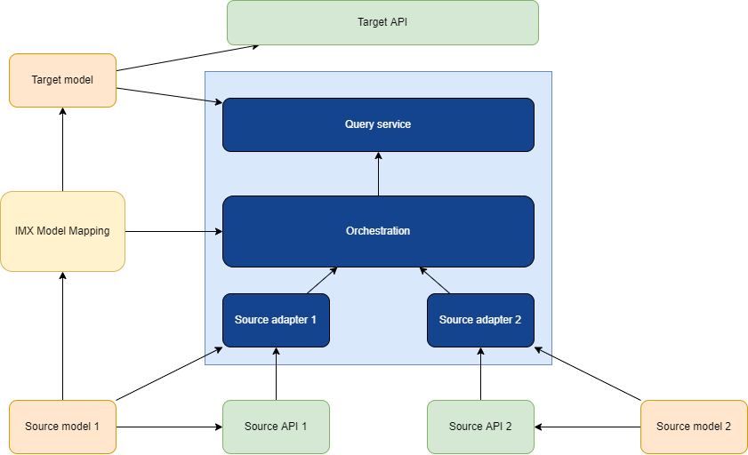

# Basic concepts

The IMX model mapping plays an important role in the reference architecture of the [=IMX orchestration process=]. The mapping serves as a translation from one or more source model based API data sources towards a target model based API data source.

The IMX model mapping is the core of what drives the [=orchestration process=] that will handle requests to the target API.

The <dfn data-lt="orchestration process">IMX orchestration process</dfn> is an activity which can answer requests on a [=target data source=], generated in accordance with a [=target model=], by orchestrating requests on the underlying [=source data sources=], which correspond with [=source models=], driven by a [=IMX model mapping=], combining the results.

The [=orchestration process=] is carried out by an [=IMX orchestration engine=]. An <dfn>IMX orchestration engine</dfn> is a software component which takes an [=IMX model mapping=], one or more [=source models=] and [=source data sources=], and a [=target model=], and generates a [=target data source=] in accordance with the [=target model=] which carries out he [=orchestration process=].

A <dfn>data source</dfn> is an entity which provides access to a dataset.

A <dfn>source data source</dfn> is a [=data source=] which acts as a source in an [=orchestration process=].

A <dfn>target data source</dfn> is a [=data source=] which acts as the target in an [=orchestration process=].



The default way of expressing a model mapping is in [[YAML]] format. In recent years, [[YAML]] has emerged as a concise, readable format to represent information, which is widely applied as a configuration file format.

<aside class="example" title="IMX Model Mapping in YAML">

  ```yaml
  objectTypeMappings:
    Address:
      sourceRoot: bag:Nummeraanduiding
      propertyMappings:
        addressID:
          pathMappings:
            path: identificatie
        locatorDesignator:
          pathMappings:
            - path: huisnummer
            - path: huisnummertoevoeging
              map:
                type: prepend
                options:
                  prefix: ' '
            - path: huisletter
              map:
                type: prepend
                options:
                  prefix: ' '
          combine:
            type: join
        postCode:
          pathMappings:
            path: postcode
        postName:
          pathMappings:
            path: ligtIn/naam
            andThen:
              ifMatch:
                type: isNull
              path: ligtAan/ligtIn/naam
        thoroughfare:
          pathMappings:
            path: ligtAan/naam
  ```
</aside>
