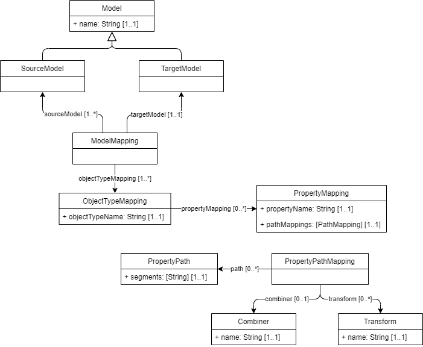

# Mapping abstract model

## Source model (`SourceModel`)

A <dfn>source model</dfn> is a [=model=] which is used to define the structure of [=data elements=] in a [=source data source=] in an IMX orchestration process.

## Target model (`TargetModel`)

A <dfn>target model</dfn> is a [=model=] which is used to define the structure of [=data elements=] in the [=target data source=] in an IMX orchestration process.

## Model mapping (`ModelMapping`)

A <dfn>model mapping</dfn> is a set of declarations which afford the combination and translation of one ore more source data model based data sources to a target data model based data source.

_Overview relations_

| Name              | Cardinality | Definition                                            |
|-------------------|-------------|-------------------------------------------------------|
| sourceModel       | 1..*        | A relation pointing to a [=source model=].         |
| targetModel       | 1..1        | A relation pointing to a [=target model=].         |
| objectTypeMapping | 0..*        | A relation pointing to an [=object type mapping=]. |

## Object type mapping (`ObjectTypeMapping`)

An <dfn>object type mapping</dfn> is a set of declarations which express the mapping of one or more [=source model=] based [=data elements=] to a target-model-object-type-based [=data object=].

_Overview attributes_

| Name              | Cardinality | Definition                                                                                              |
|-------------------|-------------|---------------------------------------------------------------------------------------------------------|
| objectTypeName    | 0..*        | The name of the [=object type=] in the target model which is the target of this object type mapping. |

_Overview relations_

| Name              | Cardinality | Definition                                            |
|-------------------|-------------|-------------------------------------------------------|
| sourceModel       | 1..*        | A relation pointing to a [=source model=].         |
| targetModel       | 1..1        | A relation pointing to a [=target model=].         |
| objectTypeMapping | 0..*        | A relation pointing to an [=object type mapping=]. |

## Property mapping (`PropertyMapping`)

A <dfn>property mapping</dfn> is a set of declarations which express the mapping of a target [=object type=] [=property=] within an [=object type mapping=].

_Overview attributes_

| Name         | Cardinality | Definition                                                                                             |
|--------------|-------------|--------------------------------------------------------------------------------------------------------|
| propertyName | 0..*        | The name of the [=property=] in the target model which is the target of this property type mapping. |

_Overview relations_

| Name              | Cardinality | Definition                                                              |
|-------------------|-------------|-------------------------------------------------------------------------|
| pathMappings      | 0..*        | An ordered list of relations pointing to a [=property path mapping=]. |

## Property Path mapping (`PropertyPathMapping`)

A <dfn>property path mapping</dfn> is a set of declarations which express a reference to a [=>data element=] of an [=information object=] of a [=source data source=].

_Overview relations_

| Name | Cardinality | Definition                                     |
|------|-------------|------------------------------------------------|
| path | 0..*        | A relation pointing to a [=property path=]. |

## Property path (`PropertyPath`)

A <dfn>property path</dfn> is ...

A <dfn data-lt="segments">segment</dfn> is ...

_Overview attributes_

| Name     | Cardinality | Definition                                                                                              |
|----------|-------------|---------------------------------------------------------------------------------------------------------|
| segments | 1..1        | An ordered list of [=segment=] strings .... |

## Combiner (`Combiner`)

A <dfn>combiner</dfn> is a function which takes

## Transform (`Transform`)

A <dfn>transform</dfn> is a function which takes
