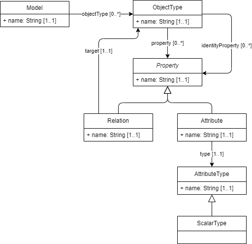

# Representing models for orchestration

To make the IMX mapping and orchestration independent of underlying modeling standards and implementations, a simple internal logical data model representation is used, to which a source model must be mapped.

<aside class="note">
The mapping to the IMX internal logical data model is left as an implementation detail.
</aside>

## Model (`Model`)

A <dfn>model</dfn> is the representation of a logical data model which can be used in an [=IMX orchestration engine=].

A logical data model is used to define [=data elements=] which which are used to describe [=objects=].

A <dfn data-lt="data elements">data element</dfn> consists of a subject, a property and a value, which together represent an elementary statement about an object.

An <dfn data-lt="objects">object</dfn> is anything that is the subject of a [=data element=].

_Overview attributes_

| Name | Cardinality | Definition             |
|------|-------------|------------------------|
| name | 1..1        | The name of the model. |

_Overview relations_

| Name              | Cardinality | Definition                                                              |
|-------------------|-------------|-------------------------------------------------------------------------|
| objectType        | 0..*        | A relation pointing to an [=object type=] that is part of the model. |

## Object type (`ObjectType`)

An <dfn>object type</dfn> represents the set of a type of [=object=].

_Overview attributes_

| Name | Cardinality | Definition                   |
|------|-------------|------------------------------|
| name | 1..1        | The name of the object type. |

_Overview relations_

| Name              | Cardinality | Definition                                                                                          |
|-------------------|-------------|-----------------------------------------------------------------------------------------------------|
| property          | 0..*        | A relation pointing to a [=property=].                                                           |
| identityProperty  | 0..*        | A relation pointing to a [=property=] which is identifying for the property-bearing object type. |

## Property (`Property`)

A <dfn>property</dfn> is a predicate which is used to express a [=data element=] about an [=object=].

_Overview attributes_

| Name | Cardinality | Definition                |
|------|-------------|---------------------------|
| name | 1..1        | The name of the property. |

### Relation (`Relation`)

A <dfn>relation</dfn> is a [=property=] which expresses a relationship between the relation-bearing [=object=] and a target [=object=]. It is a [=subtype=] of [=Property=].

_Overview relations_

| Name              | Cardinality | Definition                                                 |
|-------------------|-------------|------------------------------------------------------------|
| target            | 0..*        | The [=object type=] that is the target of the relation. |

### Attribute (`Attribute`)

An <dfn>attribute</dfn> is a [=property=] which expresses a characteristic about an [=object=].

_Overview relations_

| Name              | Cardinality | Definition                                                                                                   |
|-------------------|-------------|--------------------------------------------------------------------------------------------------------------|
| type              | 1..1        | The [=attribute type=] that is the type of the value of the [=data element=] expressing the attribute. |

## Attribute type (`AttributeType`)

An <dfn>attribute type</dfn> is a type of an [=attribute=]-expressing [=data element=].

_Overview attributes_

| Name | Cardinality | Definition                      |
|------|-------------|---------------------------------|
| name | 1..1        | The name of the attribute type. |

### Scalar type (`ScalarType`)

A <dfn>scalar type</dfn> is a [=attribute type=] which is a scalar.

Common examples of scalars are:
* String
* Integer
* Boolean
